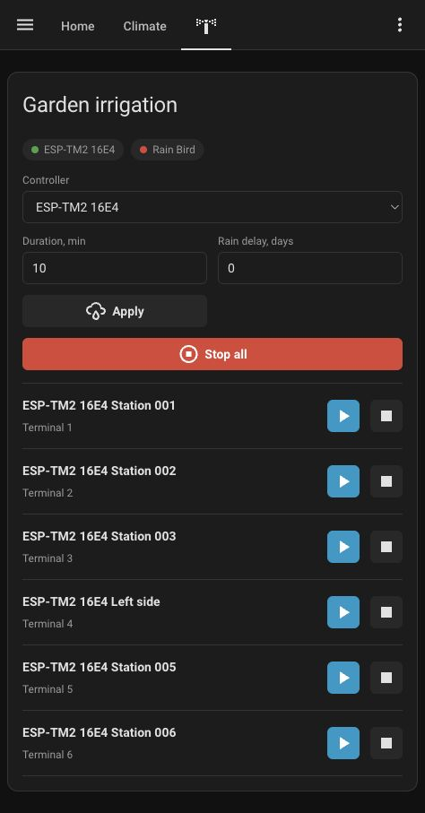

# Rain Bird IQ4 Card

Lovelace dashboard card for Rain Bird IQ4 irrigation zones in Home Assistant.

This repository contains only the dashboard card. It does not install a Rain Bird integration and it does not log in to Rain Bird by itself. Install an IQ4 integration first, then add this card to Lovelace.

Tested with the sensor-based `rainbird_iq4` integration that exposes station sensors such as `sensor.se_station_001` and services such as `rainbird_iq4.start_zone` / `rainbird_iq4.stop_zone`. The card also keeps a legacy fallback for older switch-based entities and `start_station` / `stop_station` services.

This project is unofficial and is not affiliated with Rain Bird.



## Features

- Auto-discovers Rain Bird IQ4 zone sensors.
- Falls back to legacy Rain Bird IQ4 station switches when sensor zones are not present.
- Hides the controller picker when there is only one controller.
- Shows controller connection, rain pause, forecast delay, alerts, and program schedule status.
- Keeps minutes and Run/Stop controls on the same row as the station name.
- Shows optimistic `Starting...`, `Stopping...`, and `Refreshing` feedback while Home Assistant waits for the cloud state to update.
- Throttles refresh actions so the integration refresh button is pressed at most once every 30 seconds by default.
- Shows Stop all only when one or more zones are running.

## Requirements

You need a Home Assistant integration that provides Rain Bird IQ4 entities and services.

For the newer sensor-based integration, the card expects:

- Station sensors with states like `idle`, `running`, or `paused`.
- `rainbird_iq4.start_zone` with `station_entity` and `duration`.
- `rainbird_iq4.stop_zone` with `station_entity`.
- Optional `button.*refresh`, rain delay, forecast delay, alarms, warnings, and program status entities.

For older switch-based integrations, the card can use:

- Station switches with `station_id` and `controller_id` attributes.
- `rainbird_iq4.start_station` and `rainbird_iq4.stop_station`.

## Install With HACS

1. Open **HACS** in Home Assistant.
2. Open the three-dot menu and choose **Custom repositories**.
3. Add this repository URL:

   ```text
   https://github.com/andreypopov/rainbird_iq4
   ```

4. Select repository type **Dashboard**.
5. Click **Add**.
6. Search HACS for **Rain Bird IQ4 Card**.
7. Download it.
8. Refresh your Home Assistant browser tab.

HACS should add the dashboard resource automatically. If it does not, add this resource manually:

```text
/hacsfiles/rainbird_iq4/rainbird_iq4.js
```

Resource type: **JavaScript module**.

## Manual Install

1. Download `rainbird_iq4.js` from this repository.
2. Copy it into your Home Assistant config directory:

   ```text
   /config/www/rainbird_iq4.js
   ```

3. Add this Lovelace resource:

   ```text
   /local/rainbird_iq4.js
   ```

4. Set resource type to **JavaScript module**.
5. Refresh your browser tab.

If you already use a different resource URL, such as `/local/rainbird-iq4-card.js`, that is fine as long as it points to this JavaScript file.

## Add The Card

Use this manual card YAML:

```yaml
type: custom:rainbird-iq4-card
title: Garden irrigation
auto: true
default_duration: 10
```

`default_duration` is the initial minute value shown for each zone. You can change the minutes per zone directly on the card before starting it.

For a fixed list of zones:

```yaml
type: custom:rainbird-iq4-card
title: Front lawn
auto: false
default_duration: 8
entities:
  - sensor.front_lawn_zone_1
  - sensor.front_lawn_zone_2
```

For multiple controllers, you can select the default controller:

```yaml
type: custom:rainbird-iq4-card
title: Irrigation
auto: true
controller_id: se
controller_names:
  se: Back garden
```

You can hide the program schedule section:

```yaml
type: custom:rainbird-iq4-card
title: Irrigation
show_programs: false
```

## Card Configuration

| Option | Type | Default | Description |
| --- | --- | --- | --- |
| `title` | string | `Rain Bird IQ4` | Header shown on the card. |
| `auto` | boolean | `true` | Auto-discover zone entities. |
| `default_duration` | number | `10` | Initial run duration in minutes. |
| `entities` | list | unset | Fixed list of zone entities. |
| `controller_id` | string/number | unset | Controller selected by default when multiple controllers exist. |
| `controller_names` | map | unset | Friendly names for controller IDs or prefixes. |
| `show_programs` | boolean | `true` | Show program schedule/status rows. |
| `refresh_throttle_seconds` | number | `30` | Minimum seconds between integration refresh button presses. |
| `start_refresh_delay_seconds` | number | `8` | Delay before refreshing after a zone starts. |
| `stop_refresh_delay_seconds` | number | `5` | Delay before refreshing after a zone stops. |

## Notes

- The card calls Home Assistant services; it does not talk to Rain Bird directly.
- Rain Bird cloud state can lag behind a service call. The card shows optimistic feedback immediately, then refreshes Home Assistant state.
- If a service call fails, the station row shows the error instead of silently doing nothing.
